# Parallel Neural Networks

## <u>Description of project</u>

Many deep learning architectures have focused on distributed computing. The advantages of distributed computing in deep learning are evident because it allows developers to parallelize large jobs across numerous processing units. However, GPU threading accounts for the majority of parallelization in deep learning. However, less research has been done on how to fully utilize the CPU to schedule jobs on the computing units. We want to see how we can schedule training jobs across different idle cores to maximize CPU usage on large computing machines in this project.

We present a parallelization framework in this project that allows developers to schedule many deep learning training jobs on the CPU in parallel. We demonstrate how to use our framework to execute K-Fold cross validation and Stochastic Gradient Descent on multiple CPU cores. We also propose a solution for cross compute training where the cores are on different machines on a server using a distributed parallel SGD optimizer.

## <u>Description of Repository</u>

In this repository we have included AsyncKFold and Asynschornous Stochastic Gradient Descent using HOGWILD method in pytorch.   

<u>Directory Structure</u> <br>

```

parallel-neural-networks
|
└───asset - Folder containing assets for the README for the project
|
└───common - Common module containing common code snippets
|
└───hogwild - Hogwild module containing code for Hogwild optimizer
|
└───kfold - K-Fold module containing code for AsyncKfold API
|
└───models - Module containing the different neural networks
|
└───distributed_example_cifar.py - Example for running distributed training on CIFAR dataset
|
└───distributed_example_mnist.py - Example for running distributed training on MNIST dataset
|
└───hogwild_example_cifar.py - Example for hogwild optimizer training on CIFAR dataset
|
└───kfold_example_cifar.py - Example for running parallel K-fold training on CIFAR dataset
|
└───kfold_example_mnist.py - Example for running parallel K-fold training on MNIST dataset
|
└───requirements.txt - Requirements for the project
```


## <u>Executing the code</u>
- ### Running Asynchronous KFold
To the run the Asynchronous K-Fold API, we need to define the following functions which give the API information on which models, schedulers, optimizers, etc to run K-Fold cross validation on.

```
def get_optimizer(model):
    return Adam(model.parameters(), 1e-3)

def get_models():
    return [MobileNet, LeNet, VGG]

def get_schedulers():
    return ['cosine', 'warm']

def get_dataset():
    train_dataset = CIFAR10(root="./data", train=True, download=True)
    return train_dataset

def get_criterion():
    return CrossEntropyLoss()

def get_trainer_params():
    return {"epochs": 2, "save_checkpoint_frequency": 20, "print_frequency": 15}
```
Once we have defined the above functions, we can simply call the API for K-Fold Cross Validtion in the following manner:
```
trainer_params = get_trainer_params()
kfold = AsyncKFold(2, get_dataset(), root_dir, get_criterion(), batch_size)
kfold(get_models(), get_schedulers(), get_optimizer, trainer_params)
```
- ### Running Distributed Training
To the run the Asynchronous K-Fold API, we need to define the following functions which give the API information on which models, schedulers, optimizers, etc to run K-Fold cross validation on.

```
def get_datasets():
    train_dataset = CIFAR10(root="./data", train=True)
    test_dataset = CIFAR10(root="./data", train=False)
    return train_dataset, test_dataset

def get_model():
    return VGG()

def get_optimizer(model):
    return Adam(model.parameters(), 1e-3)

def get_scheduler(optimizer):
    return MultiStepLR(optimizer, milestones=[30, 60, 90], gamma=0.1)

def get_criterion():
    return CrossEntropyLoss()
```
Once we have defined the above functions, we can simply call the API for Distributed training in the following manner:
```
trainer = DistributedTrainer(num_processes, get_criterion(), root_dir, batch_size)
trainer(model, train_dataset, optimizer, scheduler, epochs=epochs)

tester = DistributedTester(DataLoader(test_dataset, batch_size=batch_size, shuffle=True), root_dir)
tester(model)
```

## Testing on example code

- ### Testing Asynchronous KFold on MNIST dataset

```
python kfold_example_mnist.py 
```

 - ### Testing Asynchronous KFold on CIFAR dataset
```
 python kfold_example_cifar.py
 ```

## <u>Architecture of Distributed Stochastic Gradient Descent</u>

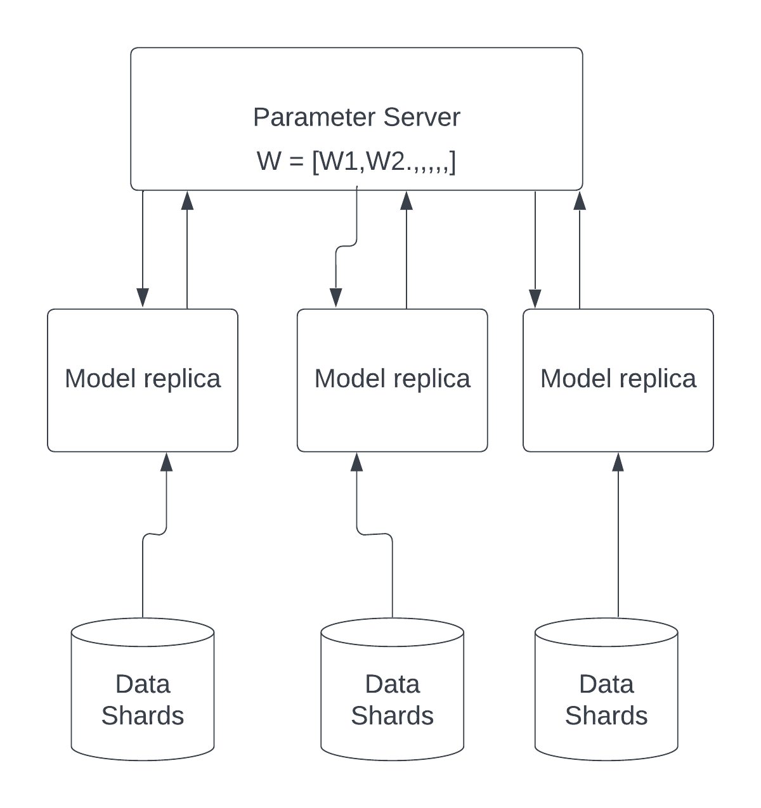

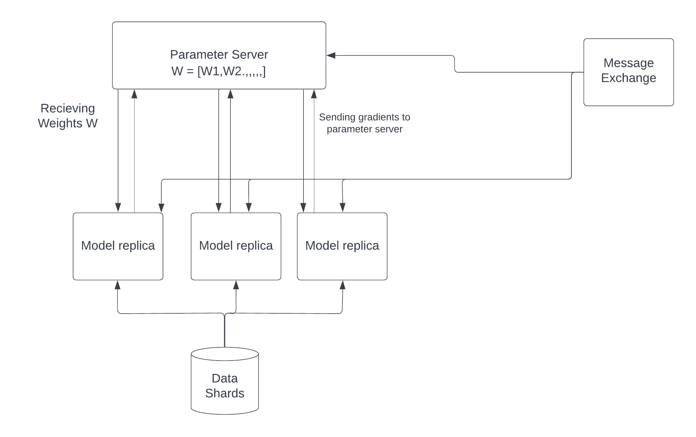

## <u>Architecture of Asynchronous K Fold Cross Validation</u>

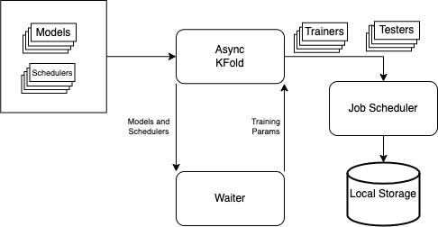

<br>


## <u>Observations For Distributed Stochastic Gradient Descent</u>

### <u>Training Loss vs Time Hogwild</u>

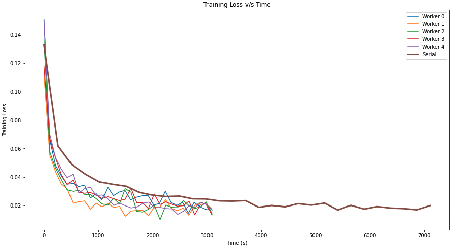

The training loss vs. time graph on the right shows that for stochastic gradient descent, parallel worker nodes can reduce the loss faster than serial execution. In addition, we can witness a speedup in the model's training time, with parallel SGD completing the training in less than half the time with virtually the same training loss on the dataset.

### <u> CPU Utilization For Serial</u>

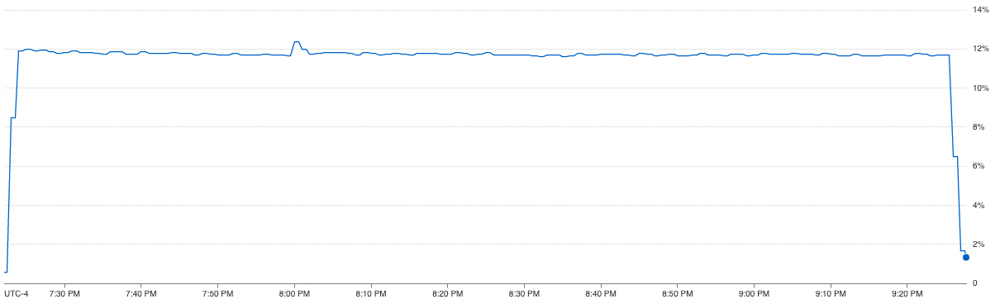

The CPU usage diagram above shows how inefficiently the resources for a computing unit are being used in the case of vanilla SGD. We can see from the graph, that the method is only able to utilize ~12% of the CPU on average. In addition to that, we can also see that parallel SGD is able to achieve 2x speedup.

### <u> CPU Utilization For Parallel</u>

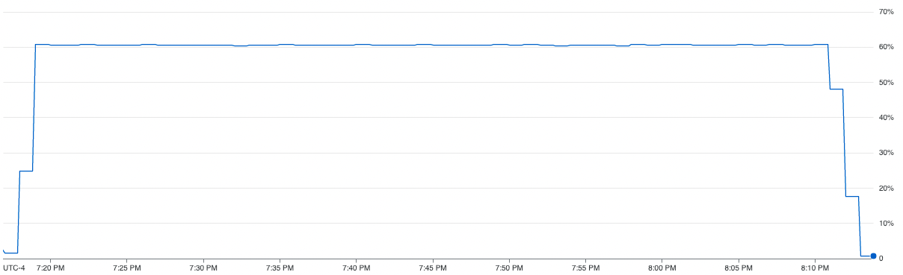

The CPU usage diagram above shows how our proposed method efficiently uses the resources for a computing unit. We can see from the graph, that the method is able to utilize close to ~60% computing resources of the CPU on average. In addition to that, we can also see that the parallel SGD also takes less amount of time to complete than the vanilla SGD.

### <u> Class Accuracies</u>
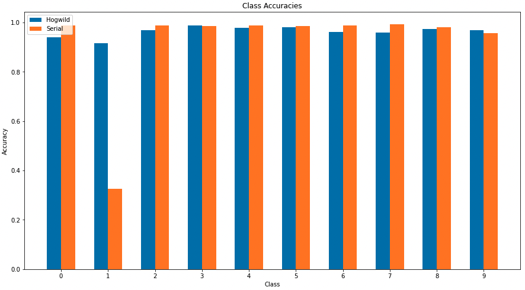

From the graph above, we can see that our model performs almost at the same level as the vanilla SGD model. Therefore, we can see that we were able to improve the training time without any trade off in convergence or accuracy.

<br>


## <u>Observations For Asynchronous KFold Cross Validation</u>

When a serial KFold is executing, the CPU is mostly idle. Our goal is to maximize CPU utilization while reducing training time without sacrificing accuracy.

The CPU utilization for running LetNet, Mobile-Net and VGG serially for cosine and warm schedulers.

### <u>CPU Utilization</u>

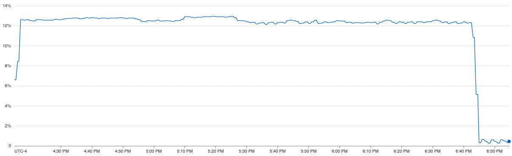

From the CPU utilization graph on the right, we can see that the serial execution of K-Fold cross validation was barely able to use ~13% of the comping resources available to it. We can also see that the serial execution total training time was 165 minutes


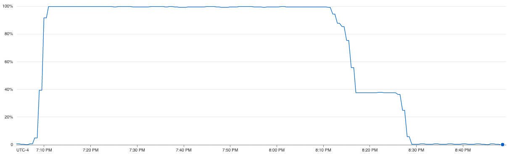

 From the CPU utilization graph on the right, we can see that the parallel execution of K-Fold cross validation was able to efficiently use all the computing resource available to it with an average utilization of 100% for the initial hour and then ~40% for second half of the training. We can also see that the execution time was just 80 minutes achieving a 2.72x speedup.


### <u>SpeedUp</u>
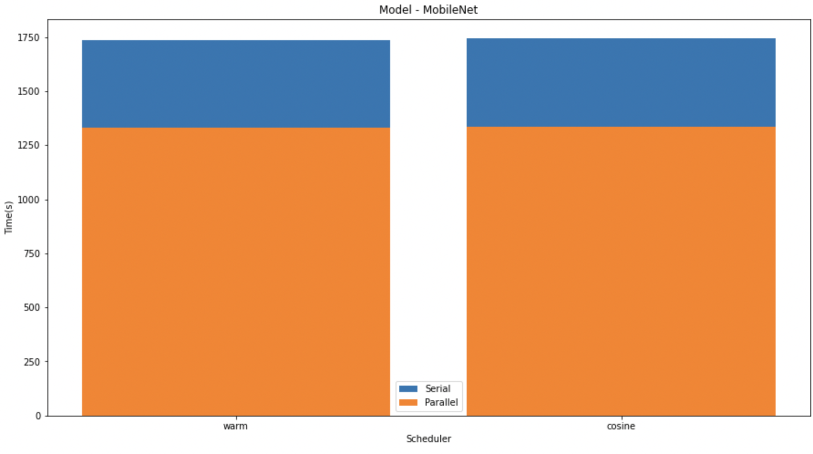
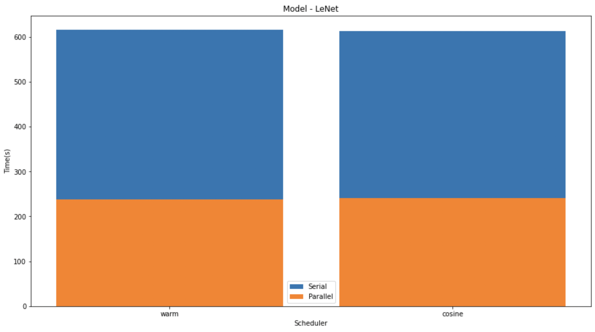
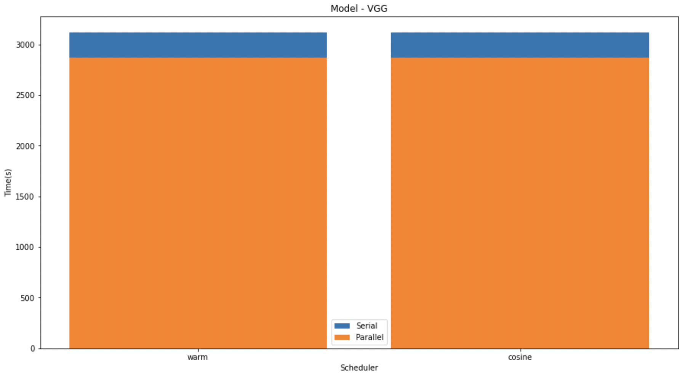

In the graphs given below, we compare the speedup of the K-Fold cross validation on the different models. We can see that on LeNet and MobileNet the speedup was significantly higher than that in VGG. This might be due to the size difference in the models.

<br>


### <u>Class Accuracies</u>
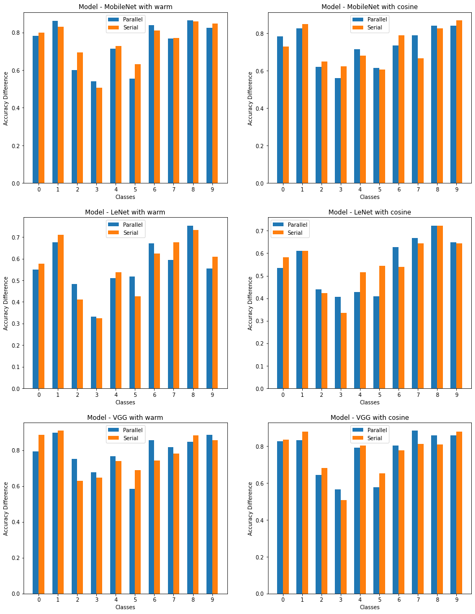
In the above graph we have shown the difference between the serial and parallel implementations of diferent models with different schedulers. 


### The accuracy table obtained is as shown

| Module | Scheduler | Parallel Accuracy | Serial Accuracy |
--- | --- | --- | --- 
 | Mobile-Net | warm  | 0.7393 | 0.7344
 | Mobile-Net | cosine | 0.7394 | 0.7334
 | LeNet | warm| 0.5634 | 0.5399
 | LeNet | cosine | 0.5359 | 0.5682
 | VGG | warm | 0.7958 | 0.7810
 | VGG | cosine | 0.7719 | 0.7538

In the graphs above, we can see that parallel K-Fold cross validation was able to perform at the same level or better than the serial K-Fold cross validation. For the different models and schedulers we can see that parallel execution had no effect on the class accuracy sometimes actually increasing the class accuracy by some margin.


 

